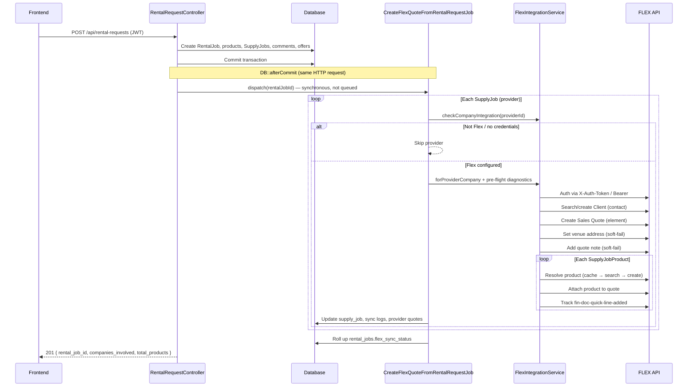
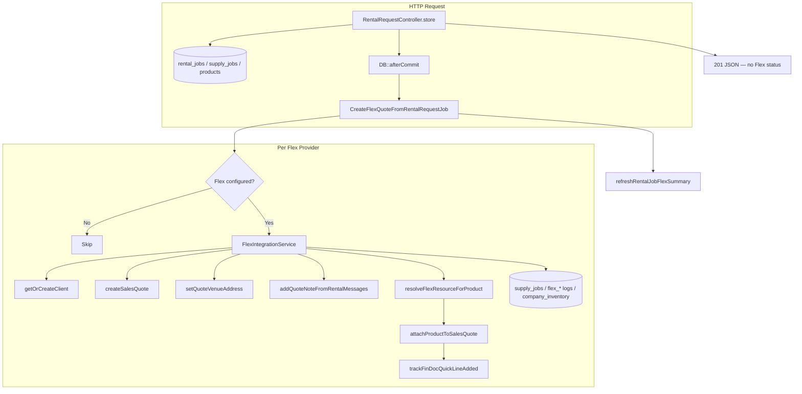

# FLEX Integration — Create Rental Request Technical Document

**Scope:** Backend flow when a rental request is created and one or more providers use **FLEX** as their rental software.  
**Primary code paths:** `RentalRequestController::store` → `CreateFlexQuoteFromRentalRequestJob` → `FlexIntegrationService`  
**Last reviewed against codebase:** July 2026

---

## 1. Overall Flow

### 1.1 Purpose

When a requester creates a rental request targeting one or more provider companies, PSM:

1. Persists the rental job and per-provider supply jobs in the local database.
2. After the DB transaction commits, **synchronously** runs Flex sales-quote creation for each provider whose rental software is Flex and who has valid Flex credentials.
3. Returns HTTP **201** for the local create. Flex sync status is **not** included in the API response body; it is persisted on supply/rental job and Flex log tables.

### 1.2 High-level sequence



### 1.3 Entry point and services involved

| Layer | Component | Role |
|-------|-----------|------|
| Route | `POST /api/rental-requests` (`routes/api.php`, JWT) | HTTP entry |
| Controller | `App\Http\Controllers\Api\RentalRequestController::store` | Validate payload, create local rental data, dispatch Flex job after commit |
| Job | `App\Jobs\CreateFlexQuoteFromRentalRequestJob` | Orchestrate Flex sync per provider (**does not implement `ShouldQueue`** — runs inline) |
| Service | `App\Services\FlexIntegrationService` | All Flex HTTP calls, product resolve, quote create/attach |
| Logger | `App\Services\FlexIntegrationLogger` | Writes `flex_integration_logs` |
| Debug | `App\Support\FlexIntegrationDebugLog` | Structured steps → `storage/logs/flex-integration.log` (+ stack) |
| Models | `RentalJob`, `SupplyJob`, `Equipment`, `CompanyIntegration`, `FlexSalesQuoteSyncLog`, `RentalRequestProviderQuote`, `FlexIntegrationLog` | Persistence |

**Deprecated alias:** `CreateFlexSalesQuoteJob` extends `CreateFlexQuoteFromRentalRequestJob` for backward compatibility.

### 1.4 Sync execution model

| Property | Behavior |
|----------|----------|
| Queued? | **No** — job has `Dispatchable` + `SerializesModels` only |
| When | `DB::afterCommit` after rental create transaction |
| Blocking | Same HTTP request waits until all providers finish (or are skipped) |
| API vs Flex | Create **201** does not depend on Flex success; Flex failures are logged and stored on supply jobs |

---

## 2. Phase A — Local Rental Request Creation

**Controller:** `RentalRequestController::store`

Before Flex runs, the controller (inside a DB transaction) typically:

1. Authenticates the requester (JWT).
2. Validates rental payload (`name`, dates, `company_products`, shipping, messages, etc.).
3. Creates:
   - `rental_jobs`
   - Aggregated `rental_job_products`
   - Per-provider `supply_jobs` + `supply_job_products`
   - Optional private `rental_job_comments`
   - Optional `job_offers`
4. Sends provider email / SMS where configured.
5. Registers `DB::afterCommit` → `CreateFlexQuoteFromRentalRequestJob::dispatch($rentalJob->id)`.
6. Returns **201**:

```json
{
  "success": true,
  "message": "Rental job created successfully",
  "data": {
    "rental_job_id": 123,
    "companies_involved": 2,
    "total_products": 5
  }
}
```

Flex quote IDs and sync statuses are **not** in this response.

---

## 3. Phase B — Flex Quote Sync (Per Provider)

**Job:** `CreateFlexQuoteFromRentalRequestJob::handle`

1. Load `RentalJob` with `user.profile`, `supplyJobs.provider`, `supplyJobs.products.product.brand`.
2. Abort if rental job or requester missing.
3. For each `SupplyJob`, call `processSupplyJob`.
4. Call `refreshRentalJobFlexSummary` to roll up `rental_jobs.flex_sync_status`.

---

## 4. Detailed Integration Steps (Order of Execution)

The following steps run **once per provider supply job**. Non-Flex providers are skipped without failing the rental request.

---

### Step 1 — Validate provider Flex configuration

**Methods:**
- `FlexIntegrationService::checkCompanyIntegration(int $providerCompanyId): bool`
- `FlexIntegrationService::forProviderCompany(int $providerCompanyId): ?self`

**Checks:**

1. Provider company exists.
2. `company.rentalSoftware.name` contains `"flex"` (case-insensitive).
3. A `company_integrations` row exists with `integration_type = 'flex'`.
4. Credentials are connected: both `api_key` and `api_base_url` present (`CompanyIntegration::isConnected()`).

**Also:**
- Create `FlexSalesQuoteSyncLog` with status `PENDING`.
- If `supply_job.flex_sales_quote_id` is already set → **skip** (duplicate prevention) and mark sync log `COMPLETED`.

**If skipped:** sync log marked `COMPLETED` with a skip reason; continue to next provider.

---

### Step 2 — Authenticate with FLEX

There is no OAuth handshake in this flow. Authentication is **API-key based** on every HTTP call.

**Headers** (`FlexIntegrationService::authHeaders`):

| Config `flex.auth_header` | Header sent |
|---------------------------|-------------|
| `x_auth` (default) | `X-Auth-Token: {api_key}` |
| `bearer` | `Authorization: Bearer {api_key}` |

- Base URL: `company_integrations.api_base_url` (per company).
- API key: encrypted `company_integrations.api_key`.
- All calls go through `flexHttp()` (timeout ~45s), which logs request/response via debug log + optional `FlexIntegrationLogger`.

**Pre-flight:** `logPreFlightDiagnostics($rentalRequestId)` records blockers (Quote definition, referral source, Client resource type, quote field IDs) into Flex logs without aborting by itself.

---

### Step 3 — Search / create customer (Flex contact)

**Method:** `getOrCreateClient(User $requester): string`

| Sub-step | Flex API | Behavior |
|----------|----------|----------|
| Resolve display name | — | Requester profile / company name helpers |
| Search contact | `GET /f5/api/contact/search?searchText={name}` | Use first result id if found |
| Resolve Client resource type | `GET /f5/api/resource-type/nodes` | Find type named **Client** (cached) |
| Create contact | `POST /f5/api/contact` | Name, email, phone, address, Client resource type |

**Output:** Flex `clientId` (contact id) used on the sales quote.

Hard failure here aborts this provider’s sync (`FAILED`) but other providers continue.

---

### Step 4 — Create the sales quote (rental request in Flex)

**Method:** `createSalesQuote(RentalJob $rentalJob, string $clientId): array`

| Sub-step | Flex API | Notes |
|----------|----------|-------|
| Quote definition | `GET /f5/api/element-definition/identity` | Resolve definition where name = **Quote** (cached) |
| Referral source | `GET /f5/api/referral-source/identity` | Must resolve **Pro Subrental Marketplace** |
| Quote field defaults | `GET /f5/api/element/{definitionId}/fields` | Optional; merged with env overrides |
| Create quote | `POST /f5/api/element/` | Creates the Flex sales quote |

**Quote payload highlights:**

| Field | Source |
|-------|--------|
| `definitionId` | Quote element definition |
| `name` | Rental job name |
| `plannedStartDate` / `plannedEndDate` | `rental_jobs.from_date` / `to_date`, formatted via `flex.quote_planned_datetime_format` (default `Y-m-d\TH:i:s`) |
| `clientId` | From Step 3 |
| `referralSourceId` | Pro Subrental Marketplace |
| Optional | `statusId`, `personResponsibleId`, `locationId`, `defaultPricingModelId` (env and/or fields API) |
| Optional | `currencyId` if `flex.include_currency_in_quote` is true |

**Returns:** `['id' => elementId, 'number' => elementNumber|null]`.

---

### Step 5 — Venue address (soft-fail)

**Method:** `setQuoteVenueAddress(string $quoteId, RentalJob $rentalJob): bool`

- `POST /f5/api/financial-document/{quoteId}/address-data`
- Uses rental `delivery_address` as free-text venue (`addressLocation=right`).
- Failure is logged; quote sync **continues**.

---

### Step 6 — Quote notes from rental messages (soft-fail)

**Method:** `addQuoteNoteFromRentalMessages(string $quoteId, RentalJob, SupplyJob): bool`

- Builds combined note from global message + private provider comment.
- `POST /f5/api/element-notification`
- Failure is logged; sync **continues**.

---

### Step 7 — Resolve each product in FLEX

For each `SupplyJobProduct` line with quantity ≥ 1:

1. Build display name: `productDisplayName(Product)` → `"Brand Model"`.
2. Load provider `company_inventory` (`Equipment`) for cached `flex_resource_id`.
3. Call `resolveFlexResourceForProduct($displayName, $cachedId, $productId)`.

#### 7.1 Product resolve pipeline

```mermaid
flowchart TD
    A[Start resolveFlexResourceForProduct] --> B{Cached flex_resource_id?}
    B -->|Yes| C[GET /inventory-model/{id}]
    C -->|Exists| D[Reuse cached Resource ID]
    C -->|Missing/invalid| E[Multi-strategy search]
    B -->|No| E
    E --> F[collectFlexProductMatches]
    F --> G{Any matches?}
    G -->|Yes| H[Use first unique match]
    H --> I[persistFlexResourceOnInventory]
    G -->|No| J[createFlexInventoryModel]
    J --> K[POST /inventory-model under Non-Serialized Model]
    K --> I
    I --> L[Return Resource ID]
    D --> L
    J -->|Create fails| M[Return null → product missing]
```

| Case | Method(s) | Flex API |
|------|-----------|----------|
| Validate cache | `flexInventoryModelExists` | `GET /f5/api/inventory-model/{id}` |
| Search | `searchFlexProductWithStrategies` → `collectFlexProductMatches` → `searchFlexProductHits` | `GET /f5/api/search` (`searchTypes=inventory-model`) |
| Create | `createFlexInventoryModel` | `GET /f5/api/inventory-group/list` then `POST /f5/api/inventory-model` |
| Persist mapping | `persistFlexResourceOnInventory` | Updates `company_inventory.flex_resource_id` for `(company_id, product_id)` |

**Search strategies** generate candidates from the product name (exact, normalized, prefixes/suffixes, model code, brand, descriptive tokens). Hits are filtered for relevance and deduped by Resource ID. For **quote sync**, the first best match is auto-selected (unlike Marketplace Inventory sync, which returns multiple matches for UI selection).

If resolve returns null → product added to **missing** list; loop continues with next line.

---

### Step 8 — Attach products to the quote

**Method:** `attachProductToSalesQuote(string $quoteId, string $resourceId, int $quantity): array`

```
POST /f5/api/financial-document-line-item/{quoteId}/add-resource/{resourceId}
  ?resourceParentId=
  &managedResourceLineItemType=inventory-model
  &quantity={qty}
```

- Body is empty (`bodyMode = query`) to match Flex Swagger add-resource behavior.
- Quantity comes from `SupplyJobProduct.required_quantity` (fallback `offered_quantity`).

**Then:** `trackFinDocQuickLineAdded()` → `POST /f5/api/user-event-tracking` with `eventType=fin-doc-quick-line-added` (soft-fail).

Attach failure for one line marks that product missing and **continues** with remaining lines.

---

### Step 9 — Pricing, quantities, and dates

| Concern | How it is handled in Flex sync |
|---------|--------------------------------|
| **Quantities** | Sent on add-resource as Flex `quantity` |
| **Dates** | Mapped to quote `plannedStartDate` / `plannedEndDate` |
| **Line pricing** | **Not pushed** from PSM `Equipment.rental_price` on attach. Flex uses its own resource pricing / quote `defaultPricingModelId` |
| **PSM prices** | Used for local job offers, emails, and UI — independent of Flex line pricing |

---

### Step 10 — Missing products notification

If any products failed resolve/attach:

- `sendMissingProductsEmail($provider, $rentalJob, $missingForEmail)` emails the provider’s default contact.

---

### Step 11 — Save mappings and synchronization data

On success path (quote was created):

| Store | Fields / content |
|-------|------------------|
| `supply_jobs` | `flex_sales_quote_id`, `flex_sales_quote_number`, `flex_sync_status` |
| `rental_request_provider_quotes` | `updateOrCreate` by `(rental_request_id, provider_id)` with quote ids + status |
| `flex_sales_quote_sync_logs` | Status, client/quote ids, `products_attached`, `products_missing`, `steps` |
| `flex_integration_logs` | Per-action audit (search, create, attach, errors, etc.) |
| `company_inventory` | `flex_resource_id` when product was found/created |
| `rental_jobs` (after all providers) | Roll-up `flex_sync_status`; optionally quote id/number if exactly one quoted supply job |

#### Sync status rules (per supply job)

| Condition | Status |
|-----------|--------|
| All lines attached, none missing | `COMPLETED` |
| Some attached, some missing | `PARTIAL` |
| None attached (quote may still exist) | `FAILED` |
| Hard exception (client/quote create) | `FAILED` |
| Skipped (not Flex / no credentials / already quoted) | Sync log `COMPLETED` (skip) |

#### Rental job roll-up (`refreshRentalJobFlexSummary`)

| Supply job statuses | Overall `rental_jobs.flex_sync_status` |
|---------------------|----------------------------------------|
| Any `FAILED` + any `COMPLETED`/`PARTIAL` | `PARTIAL` |
| All `FAILED` | `FAILED` |
| Any `PARTIAL` (no mix that yields above) | `PARTIAL` |
| Else | `COMPLETED` |

---

### Step 12 — Return the final response

The HTTP response is produced by the controller after the after-commit job finishes (because the job is synchronous).

**Success (local create OK):** HTTP **201** — body as in Phase A.  
**Does not include:** Flex quote id, sync status, attached/missing products.

**Local create failure:** HTTP **500** with generic message (debug may expose error).

Flex provider failures **do not** change the 201 into an error response; inspect:

- `supply_jobs.flex_sync_status` / `flex_sales_quote_id`
- `rental_jobs.flex_sync_status`
- `flex_sales_quote_sync_logs`
- `flex_integration_logs`
- `storage/logs/flex-integration.log`

---

## 5. FLEX API Endpoints Used in This Flow

Base URL = provider `company_integrations.api_base_url`.

| Method | Default path | Purpose |
|--------|--------------|---------|
| GET | `/f5/api/referral-source/identity` | Pro Subrental Marketplace referral |
| GET | `/f5/api/resource-type/nodes` | Client resource type |
| GET | `/f5/api/contact/search` | Find existing contact |
| POST | `/f5/api/contact` | Create contact |
| GET | `/f5/api/element-definition/identity` | Quote definitionId |
| GET | `/f5/api/element/{definitionId}/fields` | Quote field defaults |
| POST | `/f5/api/element/` | Create sales quote |
| POST | `/f5/api/financial-document/{quoteId}/address-data` | Venue |
| POST | `/f5/api/element-notification` | Notes |
| GET | `/f5/api/inventory-model/{id}` | Validate cached product |
| GET | `/f5/api/search` | Product search |
| GET | `/f5/api/inventory-group/list` | Group for product create |
| POST | `/f5/api/inventory-model` | Create inventory model |
| POST | `/f5/api/financial-document-line-item/{quoteId}/add-resource/{resourceId}` | Attach line |
| POST | `/f5/api/user-event-tracking` | Post-attach analytics event |

Paths are overridable via `config/flex.php` / `FLEX_*` env vars.

---

## 6. Key Config (`config/flex.php`)

| Key | Role in Create Rental Request Flex sync |
|-----|------------------------------------------|
| `auth_header` | Token header mode |
| `contact_search_path` / `contact_create_path` | Client lookup/create |
| `resource_type_path` / `resource_type_query` | Client type |
| `global_search_path` | Product search |
| `details_path` | Validate cached inventory model |
| `inventory_group_list_path` / `inventory_model_group_name` / `inventory_model_create_path` | Product create |
| `element_definition_identity_path` / `element_create_path` | Quote create |
| `element_fields_path_pattern` / `use_element_fields_api` | Quote field defaults |
| `financial_line_item_path` | Attach products |
| `referral_source_path` | Referral source |
| `financial_document_address_path_pattern` | Venue |
| `element_notification_path` | Notes |
| `user_event_tracking_path` | Event tracking |
| `quote_planned_datetime_format` | Date format for Flex |
| `include_currency_in_quote` | Optional currency on quote |
| `sales_quote_*_id` | Optional quote field overrides |
| Cache TTLs / `log_response_preview_max` | Caching and log size |

**Not used in this quote flow** (used by Marketplace Inventory import/sync instead): `search_path` (inventory-model search), `qty_per_location_path`, `currency_path`, `pricing_path`, custom-field paths.

---

## 7. Error Handling Summary

| Failure | Effect |
|---------|--------|
| Provider not Flex / incomplete credentials | Skip provider; rental create still 201 |
| Quote already exists on supply job | Skip; treat as completed |
| Contact or quote create throws | Mark provider `FAILED`; continue other providers |
| Venue / notes / event tracking fail | Soft-fail; continue |
| Product not found/created | Mark missing; continue other lines |
| Product attach throws | Mark that line missing; continue |
| Any missing products | Optional email to provider |
| Local rental create throws | HTTP 500; Flex job never runs |

---

## 8. Architecture Snapshot



---

## 9. Related but Separate: Marketplace Inventory → FLEX Sync

The Marketplace Inventory **Sync with FLEX** feature (`POST /api/company-inventory/search-flex-product` + `confirm-flex-sync`) reuses `FlexIntegrationService` search/create/details helpers but is **not** part of Create Rental Request. Differences:

| Aspect | Create Rental Request | Marketplace Sync |
|--------|----------------------|------------------|
| Trigger | After rental create | Manual provider action |
| Product selection | Auto first match | User selects among matches |
| Creates Flex quote | Yes | No |
| Syncs height/weight/etc. | No (resource id only via resolve) | Yes on confirm |

---

## 10. Quick Reference — Method Call Order (Flex Provider)

```
CreateFlexQuoteFromRentalRequestJob::handle
  └─ processSupplyJob (per supply job)
       ├─ FlexIntegrationLogger
       ├─ FlexIntegrationService::checkCompanyIntegration
       ├─ FlexIntegrationService::forProviderCompany
       ├─ setFlexLogger / setRentalRequestId
       ├─ logPreFlightDiagnostics
       ├─ getOrCreateClient
       │    ├─ searchContact
       │    └─ create contact (+ getClientResourceType)
       ├─ createSalesQuote
       │    ├─ getSalesQuoteDefinitionId
       │    ├─ getProSubrentalReferralSourceId
       │    └─ resolveQuoteFieldIds
       ├─ setQuoteVenueAddress          // soft-fail
       ├─ addQuoteNoteFromRentalMessages // soft-fail
       ├─ foreach product line:
       │    ├─ productDisplayName
       │    ├─ resolveFlexResourceForProduct
       │    │    ├─ flexInventoryModelExists   // if cached
       │    │    ├─ searchFlexProductWithStrategies
       │    │    ├─ createFlexInventoryModel    // if needed
       │    │    └─ persistFlexResourceOnInventory
       │    ├─ attachProductToSalesQuote
       │    └─ trackFinDocQuickLineAdded
       ├─ sendMissingProductsEmail      // if any missing
       └─ persist supply_job + provider quote + sync log
  └─ refreshRentalJobFlexSummary
```

---

## 11. Operational Checklist

When debugging a rental request that should create a Flex quote:

1. Confirm provider rental software name contains **Flex**.
2. Confirm `company_integrations` has Flex `api_base_url` + `api_key`.
3. Check `supply_jobs.flex_sync_status` and `flex_sales_quote_id`.
4. Read `flex_sales_quote_sync_logs.steps` / `products_missing`.
5. Inspect `flex_integration_logs` and `storage/logs/flex-integration.log`.
6. Verify referral source **Pro Subrental Marketplace** exists on that Flex instance.
7. Remember: API **201** does not prove Flex quote success.
