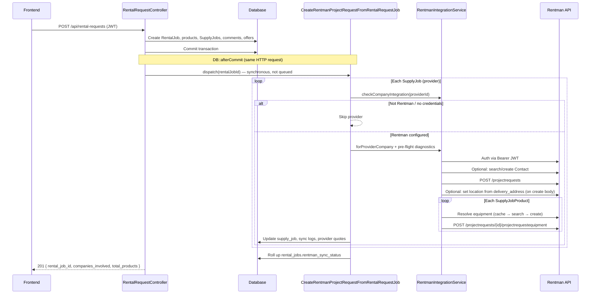
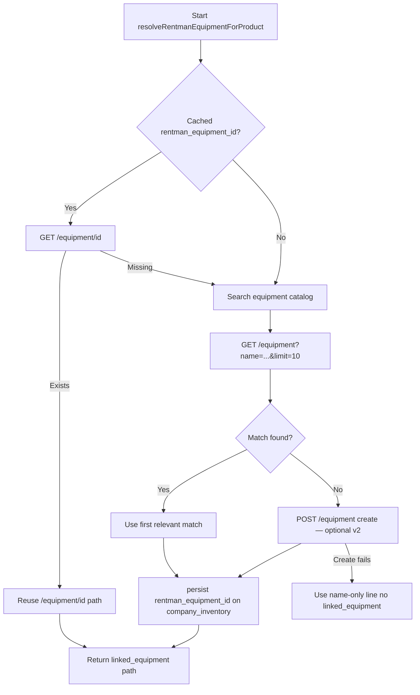
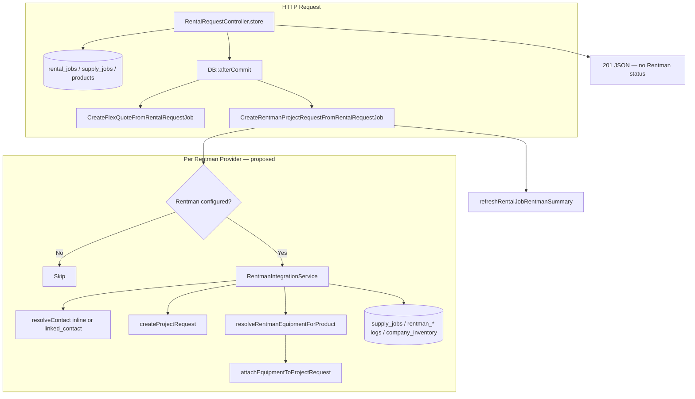

# Rentman Integration — Create Rental Request Technical Document

**Scope:** Proposed backend flow when a rental request is created and one or more providers use **Rentman** as their rental software.  
**Status:** **Implemented** — Project Request push runs synchronously after rental create for Rentman providers (`CreateRentmanProjectRequestFromRentalRequestJob` + `RentmanIntegrationService`). Equipment catalog sync/import remains available via `RentmanService` / `RentmanEquipmentController`.  
**Parallel reference:** [`FLEX_CREATE_RENTAL_REQUEST_INTEGRATION.md`](./FLEX_CREATE_RENTAL_REQUEST_INTEGRATION.md)  
**Rentman API version:** 1.15.0 (OpenAPI spec, deployed 2026-07-22)  
**Last reviewed:** July 2026

---

## 1. Overall Flow

### 1.1 Purpose

When a requester creates a rental request targeting one or more provider companies, PSM should (once implemented):

1. Persist the rental job and per-provider supply jobs in the local database (unchanged — already done by `RentalRequestController::store`).
2. After the DB transaction commits, **synchronously** push a Rentman **Project Request** for each provider whose rental software is Rentman and who has valid Rentman credentials.
3. Return HTTP **201** for the local create. Rentman sync status is **not** included in the API response body; it would be persisted on supply/rental job and Rentman log tables (mirroring Flex).

### 1.2 Conceptual mapping: FLEX vs Rentman

| PSM concept | FLEX (implemented) | Rentman (proposed) |
|-------------|-------------------|-------------------|
| External “rental request” container | Sales Quote (`POST /f5/api/element/`) | **Project Request** (`POST /projectrequests`) |
| Line items | Attach resource to quote | **Project Request Equipment** (`POST /projectrequests/{id}/projectrequestequipment`) |
| Customer / requester | Search/create Flex Client contact | Inline contact fields on project request **or** `linked_contact` via `/contacts` |
| Venue / delivery | Quote address (`financial-document/.../address-data`) | `location_*` fields on project request |
| Notes / messages | `element-notification` | `remark` on project request; `external_remark` per line; optional comment line (`is_comment`) |
| Product mapping | `flex_resource_id` → inventory-model | `rentman_equipment_id` → `linked_equipment: "/equipment/{id}"` |
| External reference back to PSM | Not primary | `external_reference` = `rental_jobs.id` (integer) |
| Provider-facing number | Flex quote `number` | Generated `displayname` (e.g. `PR-123 …`) and/or numeric `id` |
| Post-sync provider action | Quote exists in Flex | Provider reviews Project Request in Rentman UI and converts to Project |

**Important semantic difference:** Rentman **Project Request** is an inbound inquiry in the provider’s “Requests” area. It is **not** a financial quote document. Equipment added via `projectrequestequipment` appears in the request’s equipment list; the provider still converts the request to a full **Project** inside Rentman (often manually). Rentman does **not** currently expose write APIs for `/projects/{id}/projectequipment` (GET-only as of API v1.15).

### 1.3 High-level sequence (proposed)



### 1.4 Proposed entry point and services

| Layer | Component | Role |
|-------|-----------|------|
| Route | `POST /api/rental-requests` (`routes/api.php`, JWT) | HTTP entry (existing) |
| Controller | `App\Http\Controllers\Api\RentalRequestController::store` | Validate payload, create local rental data, dispatch Rentman job after commit |
| Job | `App\Jobs\CreateRentmanProjectRequestFromRentalRequestJob` *(proposed)* | Orchestrate Rentman sync per provider (synchronous, like Flex job) |
| Service | `App\Services\RentmanIntegrationService` *(proposed)* | All Rentman HTTP calls for rental-request push; extends patterns from `RentmanService` |
| Logger | `App\Services\RentmanIntegrationLogger` *(proposed)* | Audit log table |
| Debug | `App\Support\RentmanIntegrationDebugLog` *(proposed)* | Structured steps → `storage/logs/rentman-integration.log` |
| Models | `RentalJob`, `SupplyJob`, `Equipment`, `CompanyIntegration`, `RentmanProjectRequestSyncLog` *(proposed)*, `RentalRequestProviderQuote` *(extend or parallel table)* | Persistence |

**Existing today:** `RentmanService` — equipment list sync, detail fetch, files; used by import flow only.

### 1.5 Sync execution model (proposed — mirror Flex)

| Property | Behavior |
|----------|----------|
| Queued? | **No** — synchronous `afterCommit`, same as Flex |
| When | `DB::afterCommit` after rental create transaction |
| Blocking | Same HTTP request waits until all providers finish (or are skipped) |
| API vs Rentman | Create **201** does not depend on Rentman success; failures logged on supply jobs |

**Controller change:** `RentalRequestController::store` currently dispatches only `CreateFlexQuoteFromRentalRequestJob`. Implementation would dispatch **both** jobs (or a single orchestrator job that delegates per provider software).

---

## 2. Phase A — Local Rental Request Creation

**Unchanged.** See FLEX doc §2.

`RentalRequestController::store` already:

1. Authenticates requester (JWT).
2. Validates rental payload.
3. Creates `rental_jobs`, `rental_job_products`, `supply_jobs`, `supply_job_products`, comments, offers.
4. Sends provider email / SMS.
5. Registers `DB::afterCommit` → Flex job (Rentman job to be added here).
6. Returns **201** without external sync status.

---

## 3. Phase B — Rentman Project Request Sync (Per Provider)

**Proposed job:** `CreateRentmanProjectRequestFromRentalRequestJob::handle`

1. Load `RentalJob` with `user.profile`, `supplyJobs.provider`, `supplyJobs.products.product.brand`.
2. Abort if rental job or requester missing.
3. For each `SupplyJob`, call `processSupplyJob`.
4. Call `refreshRentalJobRentmanSummary` to roll up `rental_jobs.rentman_sync_status`.

---

## 4. Detailed Integration Steps (Order of Execution)

The following steps run **once per provider supply job**. Non-Rentman providers are skipped without failing the rental request.

---

### Step 1 — Validate provider Rentman configuration

**Proposed methods:**
- `RentmanIntegrationService::checkCompanyIntegration(int $providerCompanyId): bool`
- `RentmanIntegrationService::forProviderCompany(int $providerCompanyId): ?self`

**Checks (mirror Flex):**

1. Provider company exists.
2. `company.rentalSoftware.name` contains `"rentman"` (case-insensitive).
3. `company_integrations` row with `integration_type = 'rentman'`.
4. Credentials connected: `api_key` present (`CompanyIntegration::isConnected()` — Rentman does not require per-company base URL; falls back to `config('services.rentman.base_url')`).

**Also:**
- Create `RentmanProjectRequestSyncLog` with status `PENDING`.
- If `supply_job.rentman_project_request_id` already set → **skip** (duplicate prevention).

**If skipped:** sync log `COMPLETED` with skip reason; continue to next provider.

---

### Step 2 — Authenticate with Rentman

No OAuth. JWT Bearer on every call (same as `RentmanService::authHeaders`).

| Header | Value |
|--------|-------|
| `Authorization` | `Bearer {api_key}` |
| `Accept` | `application/json` |
| `Content-Type` | `application/json` |

- Base URL: `company_integrations.api_base_url` or `config('services.rentman.base_url')` (`https://api.rentman.net`).
- Token: encrypted `company_integrations.api_key` (generated in Rentman **Configuration → Integrations**).

**Pre-flight (proposed):** Log connectivity check `GET /equipment?limit=1` or `GET /statuses?limit=1`; record blockers without aborting by itself.

**Rate limits:** 50,000 req/day, 10 req/sec, max 20 concurrent.

---

### Step 3 — Resolve customer / contact

**FLEX equivalent:** `getOrCreateClient` → Flex contact search + create.

**Rentman options (choose one strategy):**

#### Option A — Inline contact on Project Request (recommended for v1)

Embed requester fields directly on `POST /projectrequests` (no separate contact API call):

| Rentman field | PSM source |
|---------------|------------|
| `contact_name` | Requester company name or `user.profile.full_name` |
| `contact_person_first_name` | `user.profile.first_name` |
| `contact_person_lastname` | `user.profile.last_name` |
| `contact_person_email` | `user.profile.email` |
| `contact_phone` | `user.profile.mobile` |
| `contact_mailing_street` | Requester company address (if available) |
| `contact_mailing_city` / `_postalcode` / `_country` | Parsed from company profile |

#### Option B — Link existing Rentman contact

| Sub-step | Rentman API | Behavior |
|----------|-------------|----------|
| Search | `GET /contacts?name={name}&limit=10` | Filter by name (Rentman supports field filters / sort) |
| Match | — | Prefer exact email match on expanded `contactpersons` if needed |
| Create | `POST /contacts` | Name, mailing address, type, optional `contactpersons` |
| Link | — | Set `linked_contact: "/contacts/{id}"` on project request body |

**Output:** Either inline contact fields or `linked_contact` path on the project request.

Hard failure on contact resolution (Option B only) aborts this provider’s sync (`FAILED`).

---

### Step 4 — Create the Project Request (rental request in Rentman)

**FLEX equivalent:** `createSalesQuote` → `POST /f5/api/element/`.

**Method (proposed):** `createProjectRequest(RentalJob $rentalJob, SupplyJob $supplyJob): array`

| Sub-step | Rentman API | Notes |
|----------|-------------|-------|
| Create request | `POST /projectrequests` | Primary container for inbound rental inquiry |

**Required body fields:**

| Field | PSM source |
|-------|------------|
| `planperiod_start` | `rental_jobs.from_date` → ISO 8601 datetime |
| `planperiod_end` | `rental_jobs.to_date` → ISO 8601 datetime |

**Recommended body fields:**

| Field | PSM source |
|-------|------------|
| `name` | `rental_jobs.name` |
| `usageperiod_start` | Same as `from_date` (optional) |
| `usageperiod_end` | Same as `to_date` (optional) |
| `external_reference` | `(int) rental_jobs.id` — idempotent lookup / support reference |
| `remark` | Combined `global_message` + `offer_requirements` + per-provider `private_message` |
| `location_name` | First line of `delivery_address` or shipping method label |
| `location_mailing_street` | Parsed from `delivery_address` (soft-fail if unparseable) |
| `language` | Provider or requester locale if known |
| Contact fields | From Step 3 |

**Returns:** `['id' => int, 'displayname' => string|null]` from response `data`.

**Not writable / generated:** `displayname`, `price`, `status`, `source`, `linked_project`.

---

### Step 5 — Venue / delivery address

**FLEX equivalent:** `setQuoteVenueAddress` (separate POST, soft-fail).

**Rentman:** Include `location_*` fields on the **initial** `POST /projectrequests` body (Step 4). There is no separate address endpoint for project requests.

| Field | Source |
|-------|--------|
| `location_name` | Job name or venue label |
| `location_mailing_street` | `delivery_address` |
| `location_mailing_city` | Parsed if possible |
| `location_mailing_postalcode` | Parsed if possible |
| `location_mailing_country` | Parsed or provider default |

If address parsing fails, still create the project request with `remark` containing full `delivery_address` (soft-fail pattern).

---

### Step 6 — Notes from rental messages

**FLEX equivalent:** `addQuoteNoteFromRentalMessages` → `POST /element-notification`.

**Rentman:**

| Message source | Target |
|----------------|--------|
| `global_message` + `offer_requirements` + provider `private_message` | `remark` on project request (Step 4) |
| Per-line notes (e.g. “similar OK”) | `external_remark` on each `projectrequestequipment` line |
| Optional standalone note | `POST .../projectrequestequipment` with `is_comment: true`, `name` = note text |

All note paths are soft-fail except project request create itself.

---

### Step 7 — Resolve each product in Rentman

For each `SupplyJobProduct` line with quantity ≥ 1:

1. Build display name: `"Brand Model"` (same as Flex `productDisplayName`).
2. Load provider `company_inventory` (`Equipment`) for cached `rentman_equipment_id`.
3. Call `resolveRentmanEquipmentForProduct($displayName, $cachedId, $productId)`.

#### 7.1 Product resolve pipeline (proposed)



| Case | Method(s) | Rentman API |
|------|-----------|-------------|
| Validate cache | `rentmanEquipmentExists` | `GET /equipment/{id}` |
| Search | `searchRentmanEquipment` | `GET /equipment?name={term}&fields=id,name,displayname,code&limit=10` |
| Create (optional v2) | `createRentmanEquipment` | `POST /equipment` |
| Persist mapping | `persistRentmanEquipmentOnInventory` | Update `company_inventory.rentman_equipment_id` |

**Difference from Flex:** Rentman allows **unlinked** request lines (`name` + `quantity` only). Provider matches equipment manually when converting request → project. Linked equipment is strongly preferred when `rentman_equipment_id` is known.

If resolve returns null → add line with `name` only (partial success), or mark missing per policy.

---

### Step 8 — Attach products to the Project Request

**FLEX equivalent:** `attachProductToSalesQuote`.

**Method (proposed):** `attachEquipmentToProjectRequest(int $projectRequestId, ...): array`

```
POST /projectrequests/{id}/projectrequestequipment
Content-Type: application/json

{
  "name": "Shure SM58",
  "quantity": 2,
  "quantity_total": 2,
  "linked_equipment": "/equipment/12345",
  "unit_price": 25.00,
  "external_remark": "Similar products acceptable"
}
```

| Field | Source |
|-------|--------|
| `name` | Product display name |
| `quantity` | `SupplyJobProduct.required_quantity` |
| `quantity_total` | Same as `quantity` |
| `linked_equipment` | `"/equipment/{rentman_equipment_id}"` when resolved |
| `unit_price` | `Equipment.rental_price` (optional — unlike Flex, Rentman accepts line price) |
| `external_remark` | Similar-product flag / line notes |

Attach failure for one line marks that product missing and **continues** with remaining lines.

---

### Step 9 — Pricing, quantities, and dates

| Concern | FLEX | Rentman (proposed) |
|---------|------|-------------------|
| **Quantities** | Query param on add-resource | `quantity` / `quantity_total` on equipment line |
| **Dates** | Quote `plannedStartDate` / `plannedEndDate` | `planperiod_start` / `planperiod_end` on project request |
| **Line pricing** | Not pushed on attach | **Can push** `unit_price` per line |
| **Header pricing** | Flex-calculated | `price` on project request is **generated** — do not set |
| **PSM prices** | Local offers / emails only | Same — `unit_price` push is optional |

---

### Step 10 — Missing products notification

Same as Flex: if any lines failed resolve/attach, email provider default contact (`sendMissingProductsEmail` equivalent).

---

### Step 11 — Save mappings and synchronization data

**Proposed schema additions** (not in codebase today):

| Store | Fields / content |
|-------|------------------|
| `supply_jobs` | `rentman_project_request_id`, `rentman_project_request_displayname`, `rentman_sync_status` |
| `rental_request_provider_quotes` | Extend with `rentman_project_request_id` or separate `rental_request_provider_rentman_requests` table |
| `rentman_project_request_sync_logs` | Status, request id, `products_attached`, `products_missing`, `steps` |
| `rentman_integration_logs` | Per-action audit |
| `company_inventory` | `rentman_equipment_id` when product was found (already exists) |
| `rental_jobs` | Roll-up `rentman_sync_status` |

#### Sync status rules (mirror Flex)

| Condition | Status |
|-----------|--------|
| All lines attached with `linked_equipment`, none missing | `COMPLETED` |
| Some linked, some name-only or failed | `PARTIAL` |
| Project request created but no lines attached | `FAILED` |
| Hard exception (project request create) | `FAILED` |
| Skipped (not Rentman / no credentials / already synced) | Sync log `COMPLETED` (skip) |

---

### Step 12 — Return the final response

Unchanged from Flex: HTTP **201** after synchronous jobs complete. Does **not** include Rentman project request id or sync status.

Inspect (once implemented):

- `supply_jobs.rentman_sync_status` / `rentman_project_request_id`
- `rental_jobs.rentman_sync_status`
- `rentman_project_request_sync_logs`
- `rentman_integration_logs`
- `storage/logs/rentman-integration.log`

---

## 5. Rentman API Endpoints Used in This Flow

Base URL = `https://api.rentman.net` (or provider `company_integrations.api_base_url`).

| Method | Path | Purpose | FLEX parallel |
|--------|------|---------|---------------|
| GET | `/equipment?limit=1` | Pre-flight connectivity | — |
| GET | `/contacts` | Search existing contact | `GET /f5/api/contact/search` |
| POST | `/contacts` | Create contact (Option B) | `POST /f5/api/contact` |
| POST | `/projectrequests` | **Create rental inquiry** | `POST /f5/api/element/` |
| PUT | `/projectrequests/{id}` | Update request (retry / amend) | — |
| GET | `/projectrequests/{id}` | Verify / fetch after create | — |
| POST | `/projectrequests/{id}/projectrequestequipment` | **Add equipment line** | `POST .../add-resource/{resourceId}` |
| PUT | `/projectrequestequipment/{id}` | Update line qty/price | — |
| GET | `/equipment/{id}` | Validate cached equipment id | `GET /f5/api/inventory-model/{id}` |
| GET | `/equipment` | Search catalog | `GET /f5/api/search` |
| POST | `/equipment` | Create equipment (optional v2) | `POST /f5/api/inventory-model` |

**Not used for this flow (read-only or wrong lifecycle stage):**

| Path | Why excluded |
|------|--------------|
| `/quotes`, `/projects/{id}/quotes` | Quotations are generated **after** project exists; GET-only |
| `/projects/{id}/projectequipment` | GET-only — cannot push equipment to project view via API |
| `/projectequipment` | Planned equipment on existing projects; no POST in v1.15 |

---

## 6. Key Config (proposed `config/rentman.php`)

| Key | Role |
|-----|------|
| `base_url` | Default API host (`services.rentman.base_url`) |
| `timeout` | HTTP timeout (existing sync uses 120s) |
| `project_request_path` | `/projectrequests` |
| `project_request_equipment_path_pattern` | `/projectrequests/{id}/projectrequestequipment` |
| `contact_search_path` | `/contacts` |
| `contact_create_path` | `/contacts` |
| `equipment_search_fields` | `id,name,displayname,code,updateHash` |
| `planperiod_datetime_format` | ISO 8601 with timezone, e.g. `Y-m-d\TH:i:sP` |
| `use_linked_contact` | `false` = inline contact (Option A); `true` = search/create contact |
| `push_unit_price` | Whether to send PSM `rental_price` on equipment lines |
| `create_equipment_if_missing` | `false` for v1 (name-only fallback); `true` for v2 |
| `log_response_preview_max` | Log truncation |

---

## 7. Error Handling Summary

| Failure | Effect |
|---------|--------|
| Provider not Rentman / incomplete credentials | Skip provider; rental create still 201 |
| Project request already exists on supply job | Skip; treat as completed |
| Project request create throws | Mark provider `FAILED`; continue other providers |
| Location / remark / line remark fail | Soft-fail; continue |
| Equipment not found | Name-only line or mark missing; continue |
| Line attach throws | Mark line missing; continue |
| Any missing products | Optional email to provider |
| Local rental create throws | HTTP 500; Rentman job never runs |

---

## 8. Architecture Snapshot



---

## 9. Related but Separate: Marketplace Inventory → Rentman Import

**Existing today** (`RentmanEquipmentController`, `RentmanInventoryImportService`):

| Aspect | Create Rental Request (proposed) | Marketplace Import (existing) |
|--------|----------------------------------|------------------------------|
| Trigger | After rental create | Manual provider action |
| Rentman endpoints | `/projectrequests`, `/projectrequestequipment` | `/equipment`, `/equipment/{id}`, `/equipment/{id}/files` |
| Creates project request | Yes | No |
| User selects product match | Auto first match | User confirms import-check |
| Persists `rentman_equipment_id` | Yes (on resolve) | Yes (on confirm) |

Reuse `RentmanService` HTTP helpers, auth, pagination, and `rentman_equipment_id` persistence patterns.

---

## 10. Quick Reference — Method Call Order (Rentman Provider, proposed)

```
CreateRentmanProjectRequestFromRentalRequestJob::handle
  └─ processSupplyJob (per supply job)
       ├─ RentmanIntegrationLogger
       ├─ RentmanIntegrationService::checkCompanyIntegration
       ├─ RentmanIntegrationService::forProviderCompany
       ├─ setRentalRequestId / logPreFlightDiagnostics
       ├─ getOrCreateContact
       │    ├─ searchContact (list + match)
       │    └─ createContact
       ├─ foreach product line (BEFORE project request):
       │    ├─ productDisplayName
       │    ├─ resolveRentmanEquipmentForProduct
       │    │    ├─ rentmanEquipmentExists     // if cached
       │    │    ├─ local rentman_equipments
       │    │    ├─ syncAllEquipmentFromApi
       │    │    ├─ searchRentmanEquipment
       │    │    ├─ createRentmanEquipment
       │    │    └─ persistRentmanEquipmentOnInventory
       ├─ createProjectRequest (full payload: linked_contact, contact_*, location_*, periods, remark)
       ├─ foreach resolved line:
       │    └─ attachEquipmentToProjectRequest
       ├─ addProjectRequestNoteFromRentalMessages  // soft-fail confirm
       ├─ sendMissingProductsEmail                // if attach failures
       └─ persist supply_job + provider quote + sync log
  └─ refreshRentalJobRentmanSummary
```

---

## 11. FLEX ↔ Rentman Step Mapping (at a glance)

| Step | FLEX | Rentman |
|------|------|---------|
| 1 | Validate Flex integration | Validate Rentman integration |
| 2 | `X-Auth-Token` / Bearer | Bearer JWT |
| 3 | Search/create Client contact | Inline contact or `/contacts` |
| 4 | Create sales quote element | `POST /projectrequests` |
| 5 | Venue address POST | `location_*` on project request |
| 6 | Quote notification note | `remark` + `external_remark` |
| 7 | Resolve inventory-model | Resolve `/equipment/{id}` |
| 8 | Add resource to quote | `POST .../projectrequestequipment` |
| 9 | Dates on quote; no line price | Dates on request; optional `unit_price` |
| 10 | Missing products email | Same |
| 11 | `flex_sales_quote_id`, logs | `rentman_project_request_id`, logs |
| 12 | 201 without Flex status | 201 without Rentman status |

---

## 12. Implementation Checklist

### Database migrations
- [x] `supply_jobs`: `rentman_project_request_id`, `rentman_project_request_displayname`, `rentman_sync_status`
- [x] `rental_jobs`: `rentman_sync_status` (and optional header-level request id)
- [x] `rentman_project_request_sync_logs` table
- [x] `rentman_integration_logs` table
- [x] Extend `rental_request_provider_quotes` or add Rentman-specific mapping table

### Application code
- [x] `RentmanIntegrationService` (quote-push concerns; delegate catalog to `RentmanService`)
- [x] `CreateRentmanProjectRequestFromRentalRequestJob`
- [x] `RentmanIntegrationLogger` + `RentmanIntegrationDebugLog`
- [x] `config/rentman.php`
- [x] Dispatch from `RentalRequestController::store` `afterCommit` (alongside Flex job)
- [x] Provider detection: `rentalSoftware.name` contains `rentman`

### Operational
- [ ] Provider Rentman API token in `company_integrations`
- [ ] Confirm provider workflow: Project Request → manual/automated convert to Project
- [ ] Document for providers that equipment lands in **Requests**, not directly in project equipment view
- [ ] Webhook subscription (optional): `ProjectRequest` / `ProjectRequestEquipment` events via Rentman webhooks

---

## 13. Operational Checklist (post-implementation)

When debugging a rental request that should create a Rentman project request:

1. Confirm provider rental software name contains **Rentman**.
2. Confirm `company_integrations` has Rentman `api_key` (and optional `api_base_url`).
3. Check `supply_jobs.rentman_sync_status` and `rentman_project_request_id`.
4. Read `rentman_project_request_sync_logs.steps` / `products_missing`.
5. Inspect `rentman_integration_logs` and `storage/logs/rentman-integration.log`.
6. In Rentman UI: open **Requests** (not Projects/Quotes) and search by `external_reference` = PSM rental job id.
7. Remember: API **201** does not prove Rentman sync success.

---

## 14. Open Questions / Provider Variability

| Topic | Notes |
|-------|-------|
| Contact strategy | Inline (simpler) vs linked contact (cleaner CRM)? Recommend inline for v1. |
| Unlinked equipment lines | Acceptable in Rentman; provider matches on convert. Document for support. |
| `POST /equipment` on miss | Flex auto-creates; Rentman v1 can use name-only lines to reduce scope. |
| Multi-provider rental jobs | One project request per `supply_job` / provider (same as Flex per-provider quote). |
| Duplicate prevention | `external_reference` + skip if `rentman_project_request_id` already set. |
| Timezone on dates | Confirm provider Rentman account timezone vs UTC for `planperiod_*`. |
